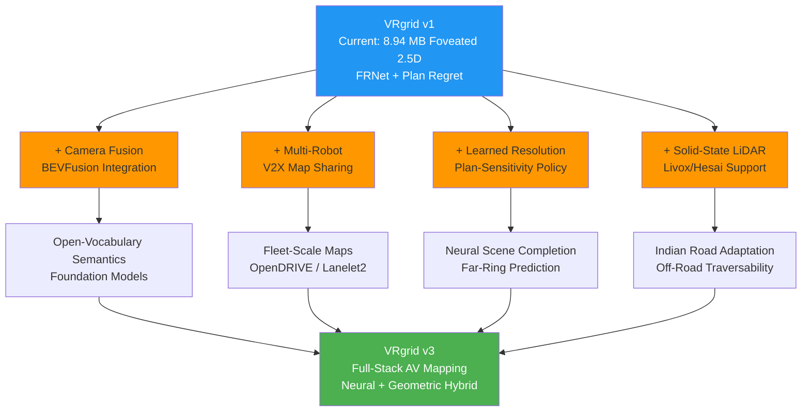

# VRgrid — Future Scope, Additional Features & Current Research
## Comprehensive R2 Research Report for SIH 2026 Round 2

**Prepared by:** Hriday (R2 — Dynamics & Segmentation Researcher)  
**Project:** SIH26053 — Adaptive Variable-Resolution 2.5D LiDAR Mapping  
**Date:** 10 September 2026  
**Repository:** [github.com/Stxtics03/vrgrid](https://github.com/Stxtics03/vrgrid)

---

## Table of Contents
1. [Project Summary](#1-project-summary)
2. [Future Scope — 14 Additional Features](#2-future-scope)
3. [Current Research & Papers](#3-current-research)
4. [Complete Papers Reference Table (30+)](#4-papers-table)
5. [Top 5 Actionable Recommendations for Round 2](#5-recommendations)
6. [Industry Trends & Indian Context](#6-industry)
7. [Evolution Roadmap](#7-roadmap)

---

## 1. Project Summary — What VRgrid Does Today

VRgrid is a **foveated 2.5D LiDAR mapping system** for autonomous ground vehicles. It replaces a uniform occupancy grid with a **variable-resolution ring-based structure** under a hard compile-time memory bound.

| Feature | Detail |
|---|---|
| **Representation** | 2.5D elevation grid with ground + ceiling layers (MLS-style) |
| **Resolution Policy** | 4 concentric rings: 5 / 10 / 20 / 40 cm, foveated by range |
| **Memory** | Fixed 8.94 MB compile-time bound (~745,000 cells) |
| **Memory Savings** | **21× less** than uniform 5 cm 2.5D grid; **286× less** than dense 3D voxels |
| **Ghost Removal** | Semantic-guided (FRNet) + range-image visibility cleanup |
| **Traversability** | 6-condition bitfield with conservative min/max pyramid queries |
| **Evaluation** | Plan Regret R(S), Coarsening Ratio ρ, Dynamic Removal F-score |
| **Key Novelty** | (a) Range+semantic foveation under hard memory bound, (b) Variance-honest split/merge with round-trip theorem (Law of Total Variance), (c) Plan-sensitivity evaluation |
| **Dataset** | SemanticKITTI (HDL-64E, all 11 labelled sequences tested) |
| **Hardware Target** | NVIDIA Jetson-class edge GPU |

### The Three Defensible Novelty Claims:
1. **Joint range + semantic foveation** under a compile-time 8.94 MB SoA memory bound
2. **Variance-honest split/merge** via Law of Total Variance with a round-trip idempotence theorem
3. **Plan-sensitivity evaluation** — measuring coarsening in units of planner regret, not reconstruction error

---

## 2. Future Scope — 14 Additional Features

### 🔴 HIGH PRIORITY — Directly Enhance Current Capabilities

#### 2.1 LiDAR-Camera Fusion for Enriched Elevation Maps
**What:** Fuse RGB camera data with LiDAR to add colour, texture, and appearance-based semantics to the 2.5D grid cells.

**Why it matters:**
- VRgrid currently relies solely on FRNet (LiDAR-only, 19-class). Camera fusion would enable:
  - **Better semantic classification** — road markings, lane types, traffic signs
  - **Texture-based traversability** — detect water puddles, oil patches, loose gravel (invisible to LiDAR)
  - **Richer feature descriptors** per cell for loop closure and relocalization
- The cell struct could store RGB mean + variance alongside elevation

**Key papers:** BEVFusion (Liu et al., ICRA 2023), TransFusion (CVPR 2022), Lift-Splat-Shoot

> [!TIP]
> **Actionable:** Add a `rgb_mean` and `rgb_var` field to `cell.py`. Use BEVFusion-style BEV-space feature injection into VRgrid's 2.5D cells.

---

#### 2.2 Multi-Robot Collaborative Mapping
**What:** Enable multiple vehicles/robots to share and merge their foveated maps in real-time using V2X communication.

**Why it matters:**
- VRgrid's **flat-array, bounded-memory structure** is uniquely suited for bandwidth-efficient map sharing (unlike tree-based OctoMap that needs complex serialization)
- The **Law of Total Variance split/merge** already handles merging observations — extending it to merge observations from different robots is mathematically natural
- Each robot sends only the ring-difference (cells that changed), not the full map → **O(perimeter) incremental sharing**
- India is deploying V2X infrastructure (NIIT + MoRTH initiative) — highly relevant for SIH context

**Key papers:** Swarm-SLAM (Lajoie et al., RA-L 2024), SlideSLAM (UCSD, 2025), UniV2X (CVPR 2024)

**Standards:** ETSI TS 103 324 (Collective Perception Message), SAE J3224 (Sensor Data Sharing Message), 3GPP Rel 16/17/18 5G NR V2X Sidelink

> [!IMPORTANT]
> **This is the single strongest future direction** because it's architecturally natural — VRgrid's fixed memory and observation-fusion math already support it.

---

#### 2.3 Neural Scene Completion for Far Rings
**What:** Use a lightweight neural network to fill in the sparse far-ring cells using learned priors about road geometry and scene structure.

**Why it matters:**
- VRgrid's own analysis shows **99.87% of cells at 50 m are empty in a single frame**: radial beam divergence ($s_{rad} = r^2 \Delta\phi / h$) gives 10.77 m ring spacing, and the azimuthal term contributes the rest — `sih-math.md` eq. (4) multiplies both. (This read 99.5% until 2026-09-13, which was the radial term alone; the full figure is 754 dead cells per live one rather than 215, so the case below is stronger, not weaker.)
- Ring 3 (40 cm, 50–100 m) relies entirely on **ring-sweep filling** over time — a prediction model could "pre-fill" ring 3 terrain before the vehicle arrives
- This directly improves **plan regret** by giving the planner earlier access to far-field traversability

**Key papers:** SCPNet (CVPR 2023), OccWorld (CVPR 2024), SurroundOcc (ICCV 2023)

> **Approach:** Train a small U-Net on ring 2–3 occupancy patterns: input = single-frame ring 2–3, output = predicted fill after 20 frames.

---

#### 2.4 Temporal Occupancy Prediction (4D Mapping)
**What:** Add a temporal prediction layer that forecasts the occupancy and traversability state of cells into the near future (1–3 seconds).

**Why it matters:**
- The current map is a snapshot — dynamic actors are removed but not tracked
- A planner needs to know: "will this cell be free in 2 seconds?"
- VRgrid's ring structure provides a natural temporal hierarchy: near rings update fast, far rings update slow → align prediction horizon with ring distance

**Key papers:** ViDAR (CVPR 2024), OccWorld (CVPR 2024), 4D Panoptic LiDAR Segmentation

> **Approach:** Add `predicted_state` field to cells in rings 0–1. Compute from residual motion (already partially captured by `residual_mos.py`).

---

#### 2.5 Solid-State LiDAR Adaptation
**What:** Extend VRgrid's ring schedule to support **non-spinning solid-state LiDARs** (Livox Mid-360, Hesai AT128/ET25, Ouster REV7).

**Why it matters:**
- VRgrid's ring schedule derives from HDL-64E spinning LiDAR geometry
- Solid-state LiDARs have **non-repetitive scan patterns** (Livox rosette), different FOVs (120° × 25°), and non-uniform point density
- India's automotive market is adopting solid-state LiDARs (cheaper, no moving parts) → makes VRgrid commercially relevant

**Key technical challenge:** Classical ring-based feature extraction (LOAM, LeGO-LOAM) fails on non-repetitive scans. Solutions like FAST-LIO2 and Point-LIO use direct scan-to-map registration with incremental k-d trees (`ik-d tree`).

> **Approach:** Add a `sensor_profile` config that derives ring boundaries from any sensor's actual point-density-vs-range curve, not just Velodyne HDL-64E parameters.

---

### 🟠 MEDIUM PRIORITY — Extend the System's Capabilities

#### 2.6 Learned Resolution Policy (Replace Fixed Schedule)
**What:** Replace the hand-designed 5/10/20/40 schedule with a **learned policy** that dynamically adjusts resolution based on sensor data, semantics, and planning demand.

**Why it matters:**
- VRgrid's own §8 of sih-math.md already derives the theory: refine only where $T(c) - J(\pi^*) < \tau$ (the "plan-sensitivity corridor")
- Making this an **online policy** (stretch goal in master-v4.md) would be a genuine research contribution
- Could use information-theoretic criteria (Psomiadis, ICRA 2024) or attention-guided mechanisms

> [!TIP]
> This directly strengthens VRgrid's headline claim: "the compression is free in decision terms." If the policy automatically adapts to ensure zero plan regret, the proof becomes constructive, not just empirical.

---

#### 2.7 Off-Road / Unstructured Indian Terrain Extension
**What:** Extend VRgrid's traversability analysis to dirt roads, agricultural fields, construction zones, rural paths.

**Why it matters for SIH:**
- SIH's context is **Indian autonomous vehicles** — structured highways are the minority
- VRgrid's 6-condition traversability bitfield handles geometric hazards already
- Need to add: **terrain deformability** (is the soil soft?), **vegetation classification** (can the vehicle push through bushes?), **water depth estimation**

**Key papers:** SALON (ICRA 2025), EVORA (IEEE T-RO 2024), WayFAST (RA-L 2024)

> **Approach:** Add `terrain_type` (paved/gravel/dirt/vegetation) and `deformability` fields to the traversability bitfield. Use camera fusion to distinguish terrain materials.

---

#### 2.8 V2X Map Sharing with HD Map Standards
**What:** Enable VRgrid to publish its real-time local map to and consume data from Vehicle-to-Everything (V2X) infrastructure.

**Key standards:**
- **OpenDRIVE** (ASAM, road geometry) → VRgrid can export traversable lanes
- **Lanelet2** (Autoware Foundation, planning-ready topology) → map traversability bitfields to regulatory lane boundaries
- **ETSI CPM / SAE SDSM** → broadcast compact VRgrid diffs over 5G NR Sidelink

> India's National Geospatial Policy favours "mapless" sensor-driven approaches over static HD maps — VRgrid's online local mapping aligns perfectly with this regulatory direction.

---

#### 2.9 Simulation Pipeline Integration (CARLA / Isaac Sim)
**What:** Build VRgrid adapters for CARLA and NVIDIA Isaac Sim.

**Why it matters for Round 2:**
- Judges will ask: "how do you test beyond SemanticKITTI?"
- CARLA provides infinite test scenarios with ground-truth semantics
- Isaac Sim's RTX LiDAR simulates physics-based beam divergence, multi-echo, atmospheric attenuation
- The synthetic sequence generator (`src/eval/synthetic.py`) already exists — extending to CARLA is natural

> NVIDIA Isaac Sim's RTX LiDAR now supports solid-state sensor patterns, enabling testing VRgrid with future sensors in simulation.

---

#### 2.10 Real-Time Dashboard Enhancements
**What:** Upgrade the Streamlit dashboard with:
- **Live 3D visualization** using Rerun (`.rrd` generation already exists)
- **Interactive ablation sweep** — drag ring schedule parameters, see plan regret change live
- **CVD-accessible palettes** (partially in `dashboard/cvd.py`)
- **Mobile-responsive view** for demo on tablet during SIH presentation

---

### 🟡 STRETCH GOALS — Future Research Directions

#### 2.11 3D Foundation Model Integration
**What:** Replace/augment FRNet with a 3D foundation model supporting open-vocabulary queries.

**Key papers:** PointINS (CVPR 2026), OpenScene (CVPR 2024), SAM3D

> VRgrid's FRNet uses a fixed 19-class vocabulary. A foundation model would enable zero-shot detection of novel obstacles (fallen trees, protest barriers, stray animals — common on Indian roads).

---

#### 2.12 Neural Implicit Hybrid Mapping
**What:** Use 3D Gaussian Splatting as a complementary layer for appearance reconstruction and scene completion.

**Key papers (2025–2026):**
- **LiDAR-GS-SLAM** (2026) — LiDAR-guided 3DGS for outdoor SLAM
- **Gaussian-LIC2** (2026) — tightly-integrated LiDAR-Inertial-Camera 3DGS
- **S3PO-GS** (CVPR 2026) — scale-consistent outdoor Gaussian splatting

> **Architecture:** VRgrid = "safety layer" (real-time traversability); 3DGS = "understanding layer" (appearance, completion). Two representations, one scene.

---

#### 2.13 Post-Quantum Secure Map Sharing
**What:** Implement lattice-based cryptographic signatures (NIST FIPS 203/204 ML-KEM/ML-DSA) for map data integrity in V2X.

**Why:** Map poisoning — injecting false road geometry via spoofed V2X messages — is a real attack vector. Falsified traversability maps could route vehicles into danger.

> Connected vehicles have 10–20 year lifespans, making them vulnerable to "Harvest Now, Decrypt Later" quantum attacks.

---

#### 2.14 Energy-Aware Mapping
**What:** Adapt ring resolution based on available compute energy — coarsen all rings when battery is low.

> VRgrid's deterministic memory bound means compute cost is predictable. Adding energy as a constraint to the resolution policy is mathematically clean.

---

## 3. Current Research & Papers Organized by Topic

### A. Representation & Spatial Compression

| Paper | Venue/Year | How It Relates to VRgrid |
|---|---|---|
| **Wavemap** (Reijgwart et al.) | RSS 2023 | 3D alternative — Haar wavelet compression. VRgrid beats it on GPU coalescing and 2.5D efficiency |
| **ML-SkiMap** (Tang et al.) | arXiv 2025 | Curvature-driven point retention (90.4% reduction). Informs VRgrid's semantic refinement policy |
| **Adaptive Patched Grid** (Wodtko et al.) | arXiv 2023 | Closest prior art — VRgrid **fixes their variance error** in split/merge |
| **Point Cloud Tomography** (Yang et al.) | IEEE T-Mech 2024 | Multi-layer 2.5D GPU traversability. Validates VRgrid's 2.5D approach |

### B. Perception & Segmentation

| Paper | Venue/Year | Relevance |
|---|---|---|
| **FRNet** (Xu et al.) | IEEE TIP 2025 | **Currently used** — VRgrid's semantic backbone |
| **FLARES** (Bosch) | arXiv 2025 | **Already applied** — confirms 64×512 sub-cloud projection choice |
| **PointINS** | CVPR 2026 | Instance-aware 3D foundation model — could replace FRNet |
| **Voxel-MAE** | 2024–2025 | Self-supervised pre-training for sparse automotive LiDAR |
| **NCLR** | arXiv 2025 | Self-supervised LiDAR-Camera neural calibration |

### C. Dynamic Object Removal

| Paper | Venue/Year | Relevance |
|---|---|---|
| **DUFOMap** | RA-L 2024 | Simpler single-parameter ray-casting free-space cleanup |
| **BeautyMap** | RA-L 2024 | **Planned fallback** — prevents over-clearing of thin structures |
| **Dynablox** | 2024 | Block-level volumetric dynamic detection |
| **DynamicMap Benchmark** (Zhang et al.) | ITSC 2023 | **Currently used** — DR/PR evaluation protocol |
| **ERASOR** | 2022 | Pseudo-occupancy ground removal |
| **LMNet** | 2020–2024 | Multi-scan residual subtraction baseline |

### D. Traversability & Planning

| Paper | Venue/Year | Relevance |
|---|---|---|
| **SALON** (Sivaprakasam et al.) | ICRA 2025 | **Already validated** — geometry-decides, semantics-filters |
| **EVORA** (Cai et al.) | IEEE T-RO 2024 | Evidential traversability with aleatoric/epistemic separation — could enhance `confidence.py` |
| **WayFAST** (Frey et al.) | RA-L 2024 | Self-supervised traversability from proprioceptive feedback |
| **RoadRunner M&M** (Patel et al.) | RA-L 2024 | **Already cited** — VRgrid's 21.5× compression benchmarked here |
| **CVaR Planning** | RSS 2025 | Conditional Value-at-Risk for risk-aware path planning |

### E. Neural Implicit + LiDAR Mapping (2025–2026 Hot Area)

| Paper | Venue/Year | Key Idea |
|---|---|---|
| **LiDAR-GS-SLAM** | arXiv 2026 | G-ICP + spherical rasterization for outdoor 3DGS SLAM |
| **Gaussian-LIC2** | arXiv 2026 | Tightly integrated LiDAR-Inertial-Camera 3DGS |
| **S3PO-GS** | CVPR 2026 | Scale-consistent outdoor Gaussian splatting |
| **Neural Lidar Fields** | NVIDIA 2025 | High-fidelity LiDAR simulation from neural fields |
| **DrivingGaussian** | CVPR 2024 | Composite Gaussian splatting for driving scenes |

### F. Foundation Models for 3D

| Paper | Venue/Year | Key Idea |
|---|---|---|
| **UniAD** | CVPR 2023 (Best Paper) | Unified perception-prediction-planning |
| **OpenScene** | CVPR 2024 | Open-vocabulary 3D scene understanding via CLIP |
| **OccWorld** | CVPR 2024 | 3D occupancy world model for AD |
| **MapTRv2** | ICLR 2024 | Online vectorized HD map construction |
| **SAM3D** | 2024–2025 | Segment Anything Model adapted for 3D point clouds |

### G. Collaborative & Multi-Robot Mapping

| Paper | Venue/Year | Key Idea |
|---|---|---|
| **Swarm-SLAM** | RA-L 2024 | Decentralized multi-robot SLAM with minimal communication |
| **SlideSLAM** | UCSD 2025 | Sparse, lightweight metric-semantic C-SLAM |
| **UniV2X** | CVPR 2024 | End-to-end V2X cooperative perception |
| **TEASER++** | 2020–2025 | Robust point cloud registration for map merging |

### H. Odometry & SLAM (ROS 2 Ecosystem)

| Package | Source | Relevance |
|---|---|---|
| **KISS-ICP** | PRBonn | Zero-IMU LiDAR odometry, works with any sensor |
| **FAST-LIO2 / Faster-LIO** | HKU MaRS Lab | Direct LIO with incremental k-d tree |
| **Point-LIO** | HKU MaRS Lab | Continuous-time LIO for solid-state sensors |
| **Autoware.Universe** | Autoware Foundation | Full AD stack with NDT localization |
| **nvblox** | NVIDIA Isaac ROS | GPU-accelerated TSDF/ESDF reconstruction |

### 3.3 Newly Discovered High-Impact Papers (2024–2026)

> [!NOTE]
> These papers were found through systematic literature search and are **not yet cited** in VRgrid. Each represents a concrete upgrade opportunity.

#### I. Adaptive Occupancy & Multi-Resolution (Directly Competing/Complementary)

| Paper | Venue/Year | Key Idea | VRgrid Upgrade Potential |
|---|---|---|---|
| **Waverider** (Reijgwart et al.) | ICRA 2024 | Motion planning that directly queries wavelet-compressed multi-res maps at variable resolution based on collision risk | Could inform VRgrid's plan-sensitivity corridor — query resolution adapts to planning need |
| **MR-Occ** (Seong et al.) | arXiv 2024 | Hierarchical multi-res voxel refinement — fine resolution only on foreground objects, coarse on road | Validates VRgrid's semantic-driven refinement; their "occluded" state could enhance VRgrid |
| **AdaOcc** (Chen et al., Bosch/NYU) | arXiv 2024 | Adaptive-resolution 3D occupancy prediction — fine around objects, coarse background | Closest neural equivalent of VRgrid's ring schedule concept |
| **PlanarMesh** (Wang et al., Oxford) | IROS 2025 | Incremental adaptive-resolution LiDAR mesh — coarse planar surfaces, fine high-curvature | O(perimeter) incremental update is exactly VRgrid's toroidal shift strategy |
| **HV-LIOM** (Chen et al.) | MDPI Sensors 2025 | Runtime-adaptive hash-voxel mapping based on local point density and curvature | Validates the core VRgrid principle: cell size should match local data density |

#### J. Task-Driven / Plan-Aware Map Representations (Directly Relevant!)

| Paper | Venue/Year | Key Idea | VRgrid Upgrade Potential |
|---|---|---|---|
| ⭐ **Clio** (Maggio et al., MIT) | RA-L 2024 | Real-time task-driven 3D scene graphs — semantic granularity adapts to robot's current task | **The closest published work to VRgrid's plan-sensitivity idea.** Cite this — it validates the philosophy but uses scene graphs, not elevation grids |
| ⭐ **FOUND-IT** (Maggio et al., MIT) | arXiv/RSS 2025 | "Granularity on demand" — planner interactively queries map at needed resolution | Extends Clio's idea; directly validates VRgrid's stretch goal of learned resolution policy |
| **Occupancy-SLAM** (Wang et al.) | IEEE T-RO 2025 | Joint optimization of poses AND occupancy grid values simultaneously | Could improve VRgrid's accuracy by jointly optimizing elevation values with ego-pose |

#### K. Uncertainty-Aware Terrain Mapping (Upgrade `confidence.py`)

| Paper | Venue/Year | Key Idea | VRgrid Upgrade Potential |
|---|---|---|---|
| ⭐ **PTS-Map** (Kim et al., Seoul Nat'l) | RA-L 2024 | Probabilistic terrain state map with Bayesian kernel inference — explicit aleatoric+epistemic uncertainty | **Direct upgrade for VRgrid's confidence module** — replace observation-count with proper Bayesian uncertainty |
| **METAVerse** (Seo et al.) | IROS 2024 | Meta-learning traversability that adapts to unseen terrains via few-shot vehicle feedback | Enables VRgrid to handle Indian off-road terrains without retraining |
| **Neural Elevation via Neural Processes** (Jung et al.) | arXiv 2025 | Continuous Gaussian process distribution over surface height — uncertainty spikes in occluded/blind spots | Could replace VRgrid's Kalman-per-cell model with a more principled uncertainty field |

#### L. Semantic-Aware Spatial Compression (Bandwidth for V2X)

| Paper | Venue/Year | Key Idea | VRgrid Upgrade Potential |
|---|---|---|---|
| ⭐ **RENO** (You et al.) | CVPR 2025 | Real-time neural LiDAR codec (~1 MB model, 10+ FPS on edge) — prioritizes semantic surfaces | Could compress VRgrid ring-diffs for V2X transmission — semantic-aware bitrate allocation |
| **ROI-Guided PCC** (Xie et al., Peking) | ACM MM 2024 | Semantic ROI-guided point cloud compression — more bits for obstacles, fewer for ground | Validates VRgrid's principle: allocate resolution by semantic importance |

#### M. Dynamic Object Removal (Upgrade Ghost Removal)

| Paper | Venue/Year | Key Idea | VRgrid Upgrade Potential |
|---|---|---|---|
| **MTD-Map** (Kim et al., Seoul/KAIST) | IROS 2025 | Mixture Transition Distribution for long-term map maintenance — differentiates fast dynamics from semi-static changes | Could extend VRgrid beyond binary dynamic/static to handle parked cars, construction |
| **Raymoval** (Kim et al., KAIST) | RiTA 2025 | Visibility-based dynamic cleaning that handles partial FOV and sensor shadows | Addresses VRgrid's known over-clearing issue on thin structures |

#### N. Edge-Deployed SLAM (Jetson Benchmarks)

| Paper | Venue/Year | Key Idea | VRgrid Upgrade Potential |
|---|---|---|---|
| **GS-LIVO** (Hong et al.) | IEEE T-RO 2025 | Incremental 3DGS on **Jetson Orin NX** — LiDAR-inertial-visual SLAM with real-time Gaussian mapping | Proves 3DGS is feasible on VRgrid's target hardware |
| **KISS-SLAM** (Guadagnino et al., Bonn) | IROS 2025 | Complete LiDAR SLAM on **CPU only** — no GPU needed, works on any embedded platform | VRgrid could use KISS-SLAM as its odometry frontend on minimal hardware |
| **FAST-LIVO2** (Zheng et al., HKU) | IEEE T-RO 2025 | Direct LiDAR-inertial-visual odometry at 40+ Hz on Jetson Xavier/Orin | State-of-the-art odometry that feeds VRgrid's ring buffer updates |

#### O. 4D Panoptic Segmentation (Upgrade FRNet)

| Paper | Venue/Year | Key Idea | VRgrid Upgrade Potential |
|---|---|---|---|
| **Zero-Shot 4D LiDAR Panoptic** (Zhang et al., TUM) | CVPR 2025 | First zero-shot 4D LiDAR panoptic seg — detects arbitrary dynamic objects without fixed classes | Could replace FRNet's fixed 19-class vocabulary with open-world detection |
| **Mask4Former** (Yilmaz et al., RWTH Aachen) | ICRA 2024 | Unified spatio-temporal mask transformer for 4D panoptic — end-to-end tracking | Better temporal consistency than FRNet's per-frame prediction |
| **Better Call SAL** | ECCV 2024 | Segment Anything adapted for sequential 3D/4D LiDAR | Foundation model for class-agnostic 4D LiDAR segmentation |

#### P. Neural Terrain & Elevation (Upgrade 2.5D Model)

| Paper | Venue/Year | Key Idea | VRgrid Upgrade Potential |
|---|---|---|---|
| **Neural Elevation Models** (Dai et al., Stanford) | ICRA 2024 Workshop | Continuous neural implicit elevation field with analytical gradients | Could complement VRgrid's discrete cells with continuous interpolation in ring transitions |
| **FastDEM** (Cho) | Open-source 2024–25 | Ultra-fast 2.5D DEM engine at 100+ Hz on Jetson Orin — zero PCL/CUDA bloat | Benchmark VRgrid against this; potential integration as VRgrid's elevation backend |
| **RoadRunner M&M** (Patel et al., ETH/JPL) | RA-L 2024 | Multi-range multi-resolution traversability (0.2m@50m, 0.8m@100m) — self-supervised | **Already cited** — confirms VRgrid's multi-resolution approach; their self-supervised training is an upgrade path |

---

## 4. Complete Papers Reference Table

> [!TIP]
> Papers marked ⭐ are most directly actionable for VRgrid. Papers marked 📘 are already cited in the project.

| # | Paper | Authors | Venue | Year | Status |
|---|---|---|---|---|---|
| 1 | 📘 FRNet | Xu et al. | IEEE TIP | 2025 | Currently used |
| 2 | 📘 FLARES | Bosch | arXiv | 2025 | Already applied |
| 3 | 📘 SALON | Sivaprakasam et al. | ICRA | 2025 | Already validated |
| 4 | ⭐ EVORA | Cai et al. | IEEE T-RO | 2024 | Upgrade confidence |
| 5 | 📘 BeautyMap | — | RA-L | 2024 | Planned fallback |
| 6 | ⭐ ML-SkiMap | Tang et al. | arXiv | 2025 | Refinement policy |
| 7 | 📘 Adaptive Patched Grid | Wodtko et al. | arXiv | 2023 | VRgrid fixes their math |
| 8 | 📘 PCT | Yang et al. | IEEE T-Mech | 2024 | Validates 2.5D approach |
| 9 | 📘 Wavemap | Reijgwart et al. | RSS | 2023 | 3D alternative |
| 10 | DUFOMap | — | RA-L | 2024 | Dynamic removal baseline |
| 11 | 📘 DynamicMap Benchmark | Zhang et al. | ITSC | 2023 | Currently used |
| 12 | 📘 RoadRunner M&M | Patel et al. | RA-L | 2024 | Memory baseline |
| 13 | ⭐ BEVFusion | Liu et al. | ICRA | 2023 | Camera-LiDAR fusion |
| 14 | ⭐ LiDAR-GS-SLAM | — | arXiv | 2026 | Neural implicit mapping |
| 15 | ⭐ Gaussian-LIC2 | — | arXiv | 2026 | Multi-modal 3DGS |
| 16 | S3PO-GS | — | CVPR | 2026 | Outdoor 3DGS |
| 17 | ⭐ PointINS | — | CVPR | 2026 | 3D foundation model |
| 18 | ⭐ Swarm-SLAM | Lajoie et al. | RA-L | 2024 | Multi-robot SLAM |
| 19 | ⭐ SCPNet | — | CVPR | 2023 | Scene completion |
| 20 | ⭐ OccWorld | — | CVPR | 2024 | 3D occupancy world model |
| 21 | ViDAR | — | CVPR | 2024 | Point cloud forecasting |
| 22 | ⭐ OpenScene | — | CVPR | 2024 | Open-vocabulary 3D |
| 23 | UniAD | — | CVPR | 2023 | Unified AD (Best Paper) |
| 24 | 📘 Psomiadis et al. | — | ICRA | 2024 | Information-bottleneck grids |
| 25 | 📘 OctoMap | Hornung et al. | Auton. Robots | 2013 | Classic 3D baseline |
| 26 | 📘 MLS Maps | Triebel et al. | IROS | 2006 | Two-layer elevation origin |
| 27 | 📘 Droeschel Multi-Res | Droeschel et al. | ICRA/JFR | 2014/16 | Foveated ring origin |
| 28 | 📘 Geometry Clipmaps | Losasso & Hoppe | SIGGRAPH | 2004 | Toroidal LOD origin |
| 29 | 📘 Elevation Mapping | Fankhauser et al. | CLAWAR | 2014 | Kalman elevation model |
| 30 | 📘 Maximum Mipmaps | Tevs et al. | I3D | 2008 | Conservative pyramid |
| 31 | ⭐ UniV2X | — | CVPR | 2024 | V2X cooperative perception |
| 32 | ⭐ MapTRv2 | Liao et al. | ICLR | 2024 | Online vectorized HD maps |
| 33 | DrivingGaussian | Zhou et al. | CVPR | 2024 | 3DGS for driving scenes |
| 34 | FAST-LIO2 | Xu & Zhang | IEEE T-RO | 2022 | Direct LiDAR-inertial odometry |
| 35 | Point-LIO | He et al. | IEEE RA-L | 2023 | Continuous-time LIO |
| 36 | ⭐ Clio (Task-Driven Maps) | Maggio et al. (MIT) | RA-L | 2024 | **Closest to VRgrid's plan-sensitivity** |
| 37 | ⭐ PTS-Map | Kim et al. (Seoul Nat'l) | RA-L | 2024 | Probabilistic terrain uncertainty |
| 38 | ⭐ RENO (Neural Codec) | You et al. | CVPR | 2025 | Real-time neural LiDAR compression |
| 39 | Waverider | Reijgwart et al. (ETH) | ICRA | 2024 | Plan-aware multi-res queries |
| 40 | AdaOcc | Chen et al. (Bosch/NYU) | arXiv | 2024 | Adaptive-res 3D occupancy |
| 41 | PlanarMesh | Wang et al. (Oxford) | IROS | 2025 | Incremental adaptive-res mesh |
| 42 | MTD-Map | Kim et al. (KAIST) | IROS | 2025 | Long-term dynamic maintenance |
| 43 | GS-LIVO | Hong et al. (HKUST) | IEEE T-RO | 2025 | 3DGS on Jetson Orin NX |
| 44 | KISS-SLAM | Guadagnino et al. (Bonn) | IROS | 2025 | CPU-only LiDAR SLAM |
| 45 | FAST-LIVO2 | Zheng et al. (HKU) | IEEE T-RO | 2025 | Direct LiDAR-inertial-visual odom |
| 46 | Zero-Shot 4D Panoptic | Zhang et al. (TUM) | CVPR | 2025 | Open-world 4D LiDAR seg |
| 47 | Mask4Former | Yilmaz et al. (RWTH) | ICRA | 2024 | Spatio-temporal mask transformer |
| 48 | Better Call SAL | — | ECCV | 2024 | Segment Anything for LiDAR |
| 49 | Neural Elevation Models | Dai et al. (Stanford) | ICRA WS | 2024 | Continuous neural terrain |
| 50 | FastDEM | Cho | Open-source | 2024–25 | 100+ Hz DEM on Jetson Orin |
| 51 | METAVerse | Seo et al. (Korea Univ) | IROS | 2024 | Meta-learning traversability |
| 52 | FOUND-IT | Maggio et al. (MIT) | arXiv/RSS | 2025 | Granularity-on-demand mapping |
| 53 | SplatAD | Hess et al. (Chalmers) | CVPR | 2025 | Unified LiDAR+camera 3DGS sim |
| 54 | LiDAR4D | Zheng et al. (Tongji) | CVPR | 2024 | 4D neural LiDAR synthesis |

---

## 5. Top 5 Actionable Recommendations for Round 2

> [!IMPORTANT]
> Frame future scope as **"the architecture enables these naturally"** — not "these are things we couldn't do." VRgrid's compile-time memory bound, Law of Total Variance math, and plan-regret evaluation are **infrastructure** that makes each future feature possible.

### The Five Features to Highlight to Judges:

| Rank | Feature | Why It's Strong | Key Citation |
|---|---|---|---|
| **1** | **Multi-Robot Collaborative Mapping** | VRgrid's flat-array bounded-memory + LoTV merge = natural V2X. No published system does this with foveated 2.5D. | Swarm-SLAM (RA-L 2024), UniV2X (CVPR 2024) |
| **2** | **Learned Adaptive Resolution Policy** | The math is already in §8 of sih-math.md. Making it online is the research step. Strengthens the headline plan-regret claim. | Psomiadis (ICRA 2024) |
| **3** | **Neural Scene Completion for Far Rings** | Directly attacks the 99.87%-empty-at-50m limitation. Improves plan regret. | SCPNet (CVPR 2023), OccWorld (CVPR 2024) |
| **4** | **Solid-State LiDAR Generalization** | Makes VRgrid commercially relevant for India's Livox/Hesai-based AV market. | FAST-LIO2, Point-LIO |
| **5** | **Evidential Uncertainty Integration** | Upgrade confidence from observation-count to aleatoric/epistemic separation. Mathematically elegant. | EVORA (T-RO 2024) |

### What NOT to Say to Judges:

> [!CAUTION]
> - **Do NOT claim** VRgrid "invented" adaptive resolution or foveation — Droeschel (2014) and Losasso (2004) did it first. Claim the **composition** and the **evaluation methodology**.
> - **Do NOT suggest** replacing 2.5D with full 3D neural representations — that undermines the core memory-bounded argument.
> - **Do NOT mention** RT-core/hardware ray-tracing — OptiX is not supported on Jetson (confirmed in master-v4.md §1.5).
> - **Do NOT claim** pothole detection beyond ~8 m — the radial sampling limit is $r_{max} = \sqrt{W \cdot h / \Delta\phi} \approx 8.3$ m for 30 cm potholes. State this as a **known physical bound**, not a limitation.
> - **Do NOT quote** ρ without its coverage column — coarse-ring ρ is estimated from sparse sub-cell samples.

---

## 6. Industry Trends & Indian Context

### Indian Autonomous Driving Companies

| Company | Mapping Philosophy | Relevance to VRgrid |
|---|---|---|
| **Minus Zero** (Bengaluru) | Vision-only, zero HD map, zero LiDAR | VRgrid provides the LiDAR alternative they deliberately avoid — show complementarity |
| **Swaayatt Robots** (Bhopal) | Sparse/mapless SLAM, game-theoretic RL | VRgrid's foveated approach aligns with their resource-efficiency philosophy |
| **Ati Motors** (Bengaluru) | Industrial 3D LiDAR SLAM for warehouses | VRgrid could replace their dense mapping with bounded-memory approach |
| **Flux Auto** | Highway freight with hybrid sensors | VRgrid's long-range ring 3 directly serves highway corridor mapping |

### ISRO & DRDO Applications

| Application | How VRgrid Helps |
|---|---|
| **LUPEX lunar rover** (ISRO-JAXA, 2027–28) | Flash LiDAR in permanently shadowed craters — VRgrid's bounded memory suits radiation-hardened embedded systems |
| **CAIR multi-robot battlefield SLAM** (DRDO) | VRgrid's collaborative mapping + bounded memory suits multi-UGV operations |
| **MUNTRA UGV** (DRDO VRDE) | Negative obstacle detection in high-altitude terrain — VRgrid already handles potholes within 8.3 m |

### Hardware Evolution

| Platform | Compute | VRgrid Benefit |
|---|---|---|
| **Jetson AGX Orin** (current) | 275 TOPS INT8 | VRgrid runs comfortably within its compute budget |
| **Jetson AGX Thor** (2025–26) | 2,000+ TOPS, FP4/FP8, 128 GB LPDDR5X | Enables concurrent BEVFusion + VRgrid + neural completion |
| **Sensor bridge (Holoscan)** | Direct DMA from LiDAR to GPU | Eliminates PCIe bounce — faster ring-buffer updates |

---

## 7. Evolution Roadmap

---

## Key Takeaway for Round 2 Defense

> VRgrid's architecture — fixed memory, Law of Total Variance math, plan-regret evaluation — is not just a mapping solution. It is **infrastructure** that enables every feature on this list. The compile-time memory bound means collaborative sharing is cheap. The variance-honest math means multi-source fusion is correct. The plan-regret metric means every upgrade can be verified: "did this change the decision a robot would make?"
>
> **That is the story. The future scope is not a wishlist — it is an architectural consequence.**
